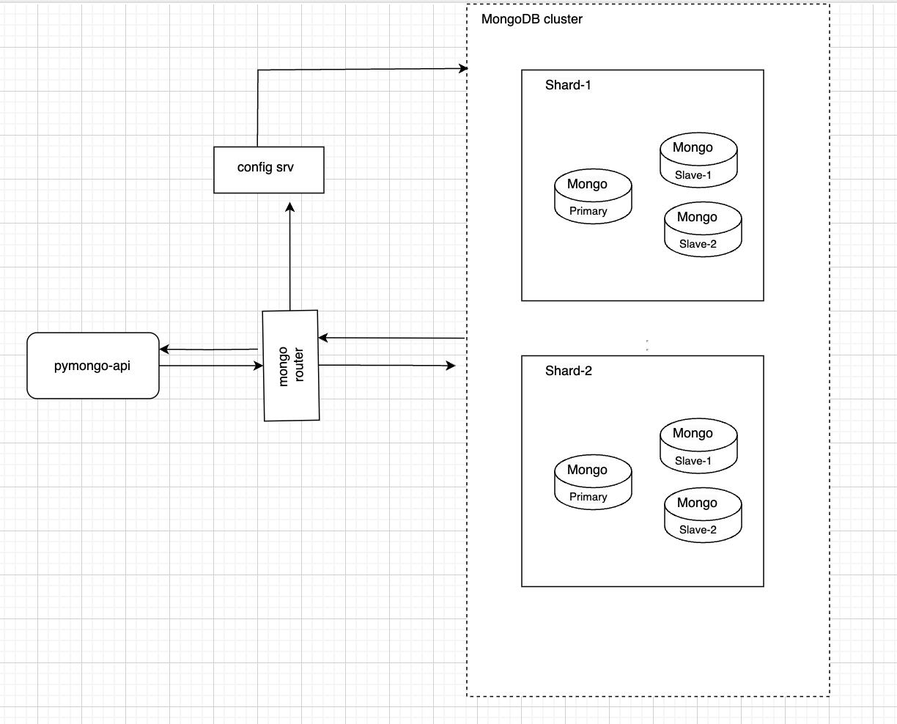

# mongo-sharding-repl

## Шаги для запуса

Переходим в дерикторию mongo-sharding-repl и выполняем следующие команды

1. Поднять контейнеры
```bash
docker compose up -d
```

2. Настроить конфигурацию шардинга и сгенерировать данные
```bash
./mongo-init.sh
```

3. Проверить результат
```bash
./mongo-post-init-check.sh
```


## Схема
