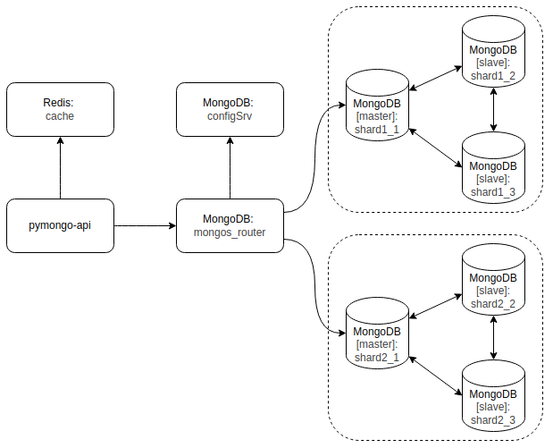

# Задание 4. Кеширование

Оригинал диаграммы решения представлен на странице "3-Caching" в файле [arch-diagram.drawio](../arch-diagram.drawio)

Для запуска и настройки приложения выполните инструкцию [Задания 3](../mongo-sharding-repl/README.md).
