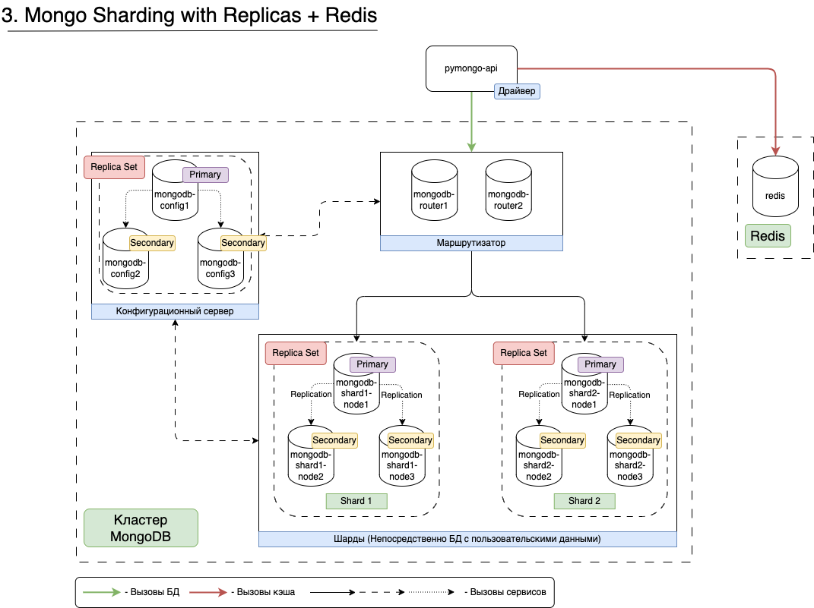

## Внимание!!!
Используется сборка из **./api_app/Dockerfile** для **pymongo_api**, так как в текущей реализации кластера MongoDB используется 2 экземпляра роутера, поэтому пришлось дорботать код, а именно убрать эту строку:

```bash
"mongo_address": client.address,
```

А если продолжить использовать docker-образ приложения kazhem/pymongo_api:1.0.0, то получим след. ошибку:

```bash
"pymongo.errors.InvalidOperation: Cannot use "address" property when load balancing among mongoses, use "nodes" instead."
```


# Задание 4

================ Реализован вариант следующей схемы ================


1. Конфигурационный сервер (3 узла)
- mongodb-config1
- mongodb-config2
- mongodb-config3

2. Маршрутизатор (2 узла)
- mongodb-router1
- mongodb-router2

3. Шард 1 (3 узла)
- mongodb-shard1-node1
- mongodb-shard1-node2
- mongodb-shard1-node3

4. Шард 2 (3 узла)
- mongodb-shard2-node1
- mongodb-shard2-node2
- mongodb-shard2-node3

5. Redis (1 узел)
- redis

================ Список команд для запуска проекта ================

1. Выполнить команду для сборки и запуска контейнеров **docker compose**

```bash
docker compose up -d
```

2. Сделать скрипт исполняемым

```bash
chmod +x ./scripts/setup-mongodb-cluster.sh
```

3. И выполнить скрипт
```bash
./scripts/setup-mongodb-cluster.sh
```


================ Скрипты для проверки ================


1. Проверить статус config-серверов (можно выполнить на любом config-сервере)
```bash
docker exec -it mongodb-config1 mongosh --port 27019 --eval 'rs.status()'
```

2. Проверить статус шардов

2.1 Для шарда 1
```bash
docker exec -it mongodb-shard1-node1 mongosh --port 27018 --eval 'rs.status()'
```

2.2 Для шарда 2
```bash
docker exec -it mongodb-shard2-node1 mongosh --port 27018 --eval 'rs.status()'
```

3. Проверить, что оба роутера видят шарды

3.1 Для mongodb-router1
```bash
docker exec -it mongodb-router1 mongosh --eval 'sh.status()'
```
3.2 Для mongodb-router2
```bash
docker exec -it mongodb-router2 mongosh --eval 'sh.status()'
```

4. Проверить кол-во документов на каждом из шардов
4.1 На первом шарде

```bash
docker exec -it mongodb-shard1-node1 mongosh --port 27018

> use somedb;
> db.helloDoc.countDocuments();
> exit();
```

Получится результат — 492 документа.

4.2 На втором шарде

```bash
docker exec -it mongodb-shard2-node1 mongosh --port 27018

> use somedb;
> db.helloDoc.countDocuments();
> exit();
```

Получится результат — 508 документа.

================ Скрипты для остановки контейнеров и уборки ================

```bash
docker compose down -v --rmi all --remove-orphans
```

================ Архитектурные схемы ================

1. Ссылка - https://drive.google.com/file/d/1HY9rx6S0_x9-mQkHP8_fQDX__QQtdtTB/view?usp=sharing
2. Файл - ./Rogozhin-architecture-sprint-2.drawio
